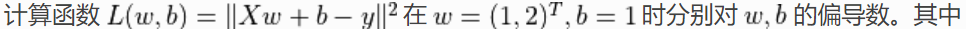
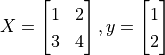

# [TensorFlow2 Learning]

## 简介

项目中的主要信息来源于  https://tf.wiki/zh/introduction.html  作为本人的学习笔记，来源可能包括原创、书籍、网页、链接等，如果侵犯了您的知识产权，请与本人联系，我将及时删除。

本项目中的所有代码和内容遵循 GNU自由文档许可证1.3或更高版本下发布，如果用于任何商业用途都需经本人同意。任何转载都请注明出处。

email: [liangzp2k#hotmail.com]


## 目录结构

按原教程组织文件分别在各目录中


### 1. 前言

   对于部分计算量较大的示例（例如 [在 cats_vs_dogs 数据集上训练 CNN 图像分类](https://tf.wiki/zh/basic/tools.html#cats-vs-dogs) ），一块主流的 NVIDIA GPU 会大幅加速训练。如果自己的个人电脑难以胜任，可以考虑在云端（例如 [免费的 Colab](https://tf.wiki/zh/appendix/cloud.html#colab) ）进行模型训练。

   安装 Anaconda，并执行如下命令

   ```shell
   conda create --name testpython=3.7   # “test”是你建立的conda虚拟环境的名字
   conda activate test  # 进入名为“tf2”的conda虚拟环境
   ```

   根据使用GPU 或 CPU 选择一个tensorflow库安装 

   ```shell
   pip install -i https://pypi.tuna.tsinghua.edu.cn/simple tensorflow
   pip install -i https://pypi.tuna.tsinghua.edu.cn/simple tensorflow-cpu
   ```

   配置  .condarc 文件，使用国内加速

   ```yaml
   channels:
     - https://mirrors.tuna.tsinghua.edu.cn/anaconda/pkgs/free/
     - https://mirrors.ustc.edu.cn/anaconda/pkgs/main/
     - https://mirrors.ustc.edu.cn/anaconda/cloud/conda-forge/
     - defaults
   ```

   再执行:

   ```shell
   conda install cudatoolkit=10.1
   conda install cudnn=7.6.5
   ```

   安装 gym 库（使用国内源） 

   ```shell
   pip install -i https://pypi.tuna.tsinghua.edu.cn/simple gym
   ```

   

------


### 2. 基础

#### 2.1.求导偏导方程

   文件： 03.partial-derivative.py





从输出可见，TensorFlow 帮助我们计算出了


#### 2.2.线性回归

   文件： 03.partial-derivative.py

考虑一个实际问题，某城市在 2013 年 - 2017 年的房价如下表所示：

| 年份 | 2013  | 2014  | 2015  | 2016  | 2017  |
| ---- | ----- | ----- | ----- | ----- | ----- |
| 房价 | 12000 | 14000 | 15000 | 16500 | 17500 |


### 3. 部署

### 4. 大规模训练与加速

### 5. 扩展

